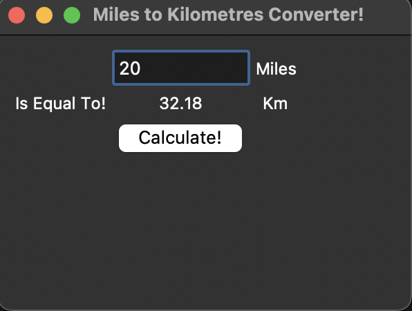

# Miles to Kilometers Converter

A simple GUI application built with Python's Tkinter library that converts distances from miles to kilometers.

## Features

- Clean, user-friendly interface
- Real-time conversion from miles to kilometers
- Simple, focused functionality
- Error handling for invalid inputs

## Requirements

- Python 3.x
- Tkinter (usually comes pre-installed with Python)

