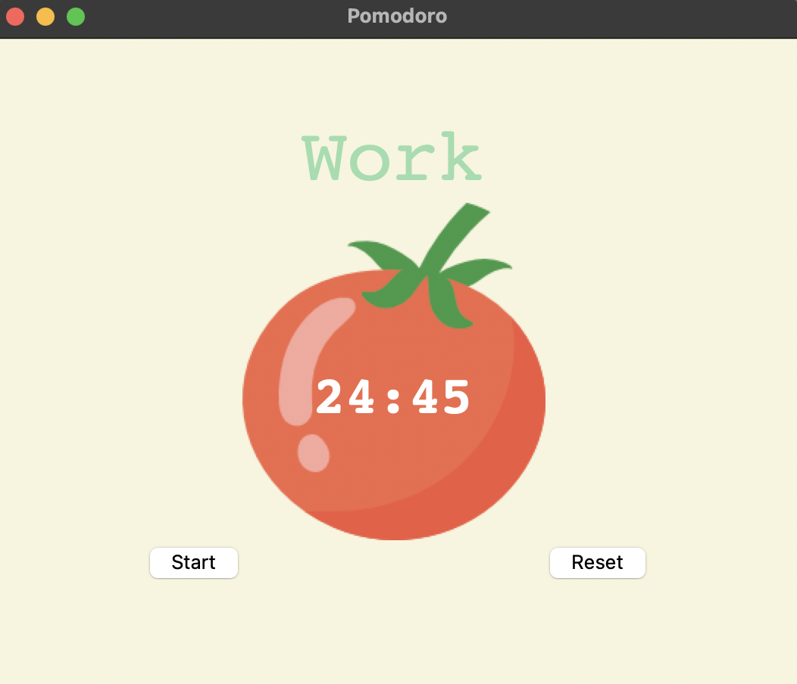

# Pomodoro Timer

A simple desktop Pomodoro Timer built with Python and Tkinter to boost your productivity through focused work sessions and regular breaks.



## About the Pomodoro Technique

The Pomodoro Technique is a time management method developed by Francesco Cirillo in the late 1980s. The technique uses a timer to break work into intervals, traditionally 25 minutes in length, separated by short breaks.

### Core Principles:

1. **Work in Focused Sprints**: Complete focused work sessions (called "Pomodoros") of 25 minutes, free from distractions.
2. **Take Regular Breaks**: Follow each work session with a 5-minute break to rest and recharge.
3. **Longer Breaks After 4 Pomodoros**: After completing 4 work sessions, take a longer break of 15-30 minutes.
4. **Track Your Progress**: Keep track of completed Pomodoros to visualize progress and maintain motivation.

### Benefits:

- Increases focus and concentration
- Reduces mental fatigue
- Creates urgency to complete tasks efficiently
- Helps maintain consistent productivity
- Improves work/break balance

## Features

- Clean, visually appealing user interface
- 25-minute work sessions
- 5-minute short breaks
- 20-minute long breaks after 4 work sessions
- Visual checkmarks to track completed work sessions
- Start and reset functionality
- Color-coded timer to indicate current session type

## Installation

1. Ensure you have Python installed (3.6 or higher recommended)


## How to Use

1. Click "Start" to begin the Pomodoro cycle
2. Work until the timer completes
3. Take a break when indicated
4. Repeat the process
5. Use the "Reset" button to restart the timer at any point

## Customization

You can customize the work and break durations by modifying the constants at the top of `main.py`:

```python
WORK_MIN = 25       # Duration of work sessions
SHORT_BREAK_MIN = 5  # Duration of short breaks
LONG_BREAK_MIN = 20  # Duration of long breaks
