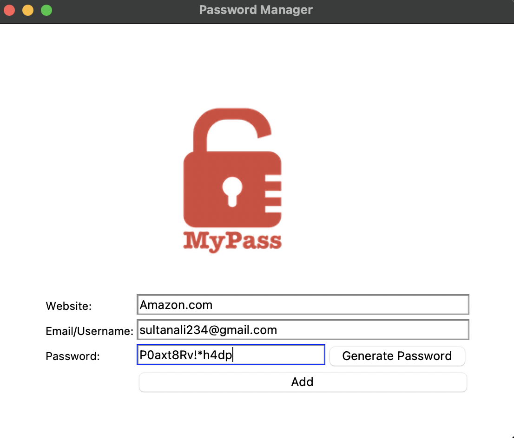

# Password Manager

A simple desktop application for securely storing and generating website credentials. Built with Python and Tkinter, this password manager helps you create strong, unique passwords and keeps track of your login information in one secure place.

## Features

- **Password Generation**: Create strong, random passwords with a single click
  - 8-10 random letters (both uppercase and lowercase)
  - 2-4 random symbols (!,#,$,%,&,(,),*,+)
  - 2-4 random numbers
  - Automatic shuffling for maximum security

- **Automatic Clipboard Copy**: Generated passwords are automatically copied to your clipboard for easy pasting into websites

- **Credential Storage**: Save your website credentials securely
  - Website name
  - Email/Username 
  - Password

- **Data Validation**: Prevents saving empty or incomplete records

- **User Confirmation**: Confirms with the user before saving new credentials

- **Clean, Minimalist Interface**: Simple and intuitive design
  - Clear field labels
  - Visual feedback with field highlighting
  - Pre-filled email field for convenience

1. Navigate to the project directory:

   **cd password-manager**

  
3. Install the required dependencies:

**pip install pyperclip**

4. Run the application:

**python main.py** #run in terminal

## Usage

### Storing New Credentials

1. Enter the website name in the "Website" field
2. Enter your email or username in the "Email/Username" field
3. Either enter a password manually or generate one (see below)
4. Click the "Add" button to save your credentials
5. Confirm the save when prompted

### Generating a Password

1. Click the "Generate Password" button
2. A strong, random password will appear in the password field
3. The password is automatically copied to your clipboard
4. Save the credentials using the "Add" button

### Viewing Saved Passwords

Your passwords are saved in a text file named "data.txt" in the application directory. Each entry follows this format:

**website | email | password**

## Security Considerations

- Passwords are stored in plain text. This application is meant for educational purposes.
- For more security, consider:
  - Using a database with encryption
  - Adding master password protection
  - Implementing automatic timeout

## Requirements

- Python 3.x
- Tkinter (usually included with Python)
- pyperclip

## Future Improvements

- Password encryption
- Search functionality for finding specific credentials
- Password strength indicator
- Automatic backup of password database
- Master password protection
- Dark mode interface

## Credits

- Created by Muhammad Ali Sultan
